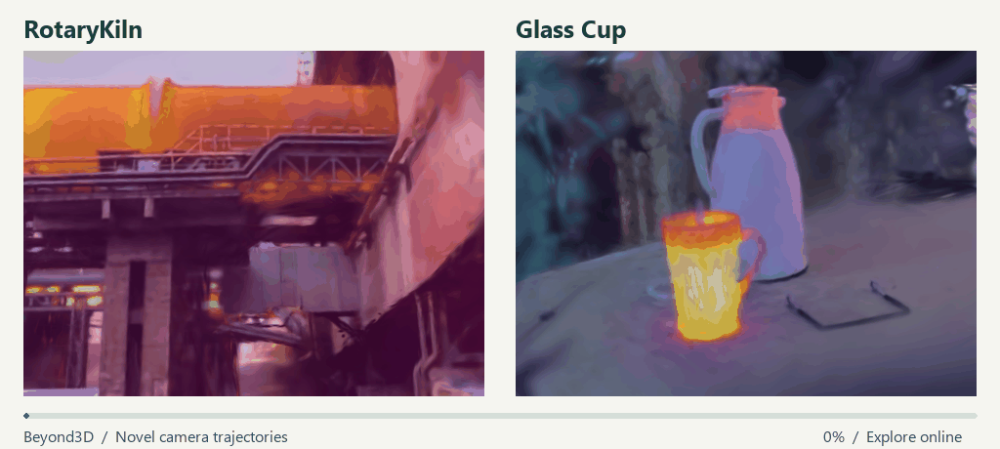
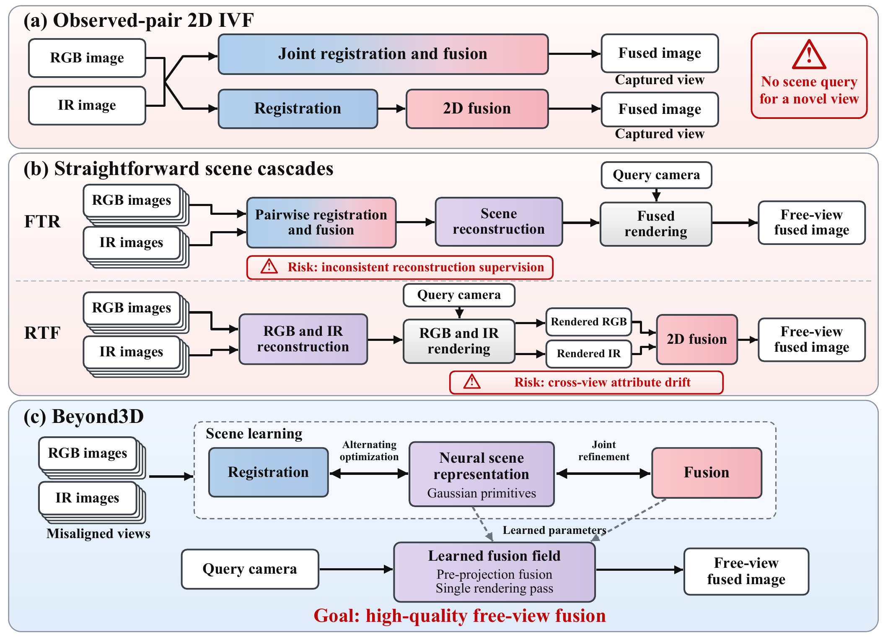
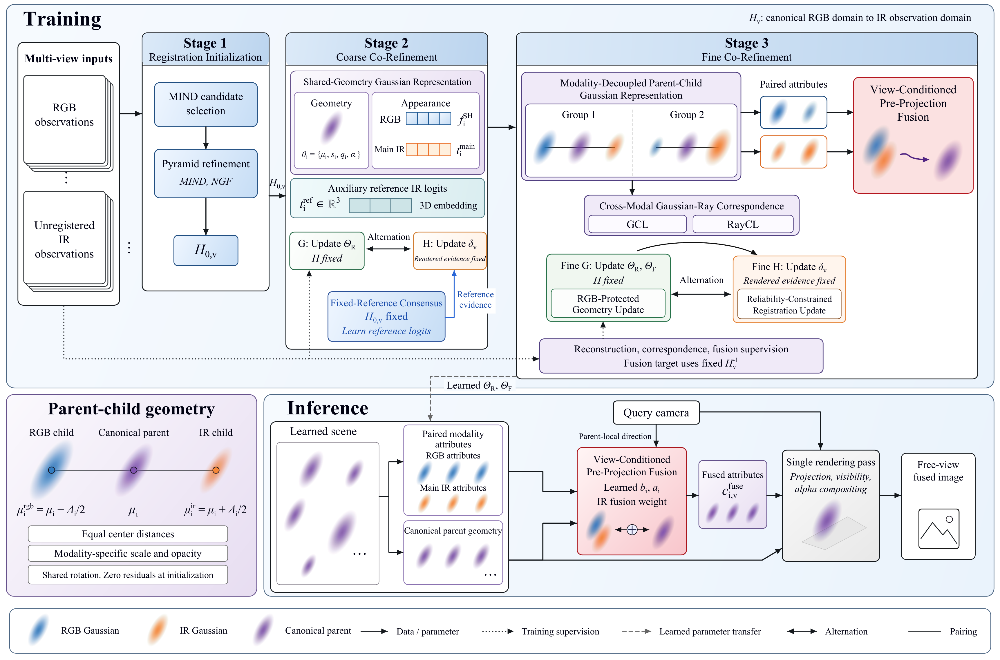
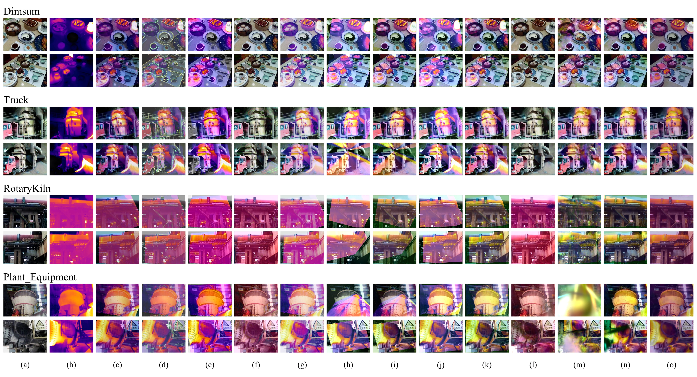

<div align="center">

# Beyond3D

## From Pair to Scene: Free-View Infrared-Visible Fusion from Misaligned RGB-IR Observations

Shengjie Hu, Hua Chen, Xiaogang Zhang, Zhengzhao Pan, Xiaoyu Zhu, and Jiuye Shi

Hunan University

**A camera-queryable scene representation for infrared-visible fusion.**

[Project page](https://popc4n.github.io/FreeIVF-3D/) · [Interactive trajectory viewer](https://popc4n.github.io/FreeIVF-3D/#explore) · [Codes](https://github.com/PopC4N/FreeIVF-3D) · [Method](#method) · [Qualitative results](#qualitative-results)

<a href="https://popc4n.github.io/FreeIVF-3D/#explore">
  
</a>

Drag through a novel camera trajectory. Inspect the same scene from a changing viewpoint.

</div>

## Explore free-view fusion

**[Open the interactive viewer →](https://popc4n.github.io/FreeIVF-3D/#explore)**

Switch between **RotaryKiln** and **Glass Cup**, drag the progress slider, or play the trajectory. Five marked positions reproduce the query views shown in the manuscript.

| Scene | Camera trajectory | Rendered views |
| --- | --- | --- |
| RotaryKiln | The selected local arc in the manuscript | 153 |
| Glass Cup | The selected local arc in the manuscript | 153 |

The viewer displays images rendered from the learned scene at recorded camera poses. It uses the complete 151-pose trajectory and two additional exact manuscript query poses for each scene. The slider selects the nearest rendered sample. Camera motion is not synthesized by blending neighboring images.

Glass Cup includes a difficult endpoint with weaker background detail farther from the training viewpoints. These examples illustrate the selected trajectories rather than a guarantee of uniform quality at every possible camera pose.

## From image pairs to a scene

Conventional infrared-visible fusion operates on captured image pairs. Free-view fusion instead learns a scene from approximately paired, residually misaligned multi-view RGB-IR observations and renders a fused image at a query camera pose, without requiring an observed image pair at that pose.

Beyond3D couples registration, Gaussian scene representation, and fusion. Its learned fusion field combines paired modality attributes before projection and compositing.

<p align="center">
  <a href="docs/assets/figures/fig-01.png"></a>
</p>

**Figure 1.** Conceptual comparison of observed-pair fusion, scene cascades, and Beyond3D. The scene representation provides a camera-query interface for fused rendering.

## Method

Key ideas in the manuscript:

1. **Registration and shared geometry.** Per-view registration initialization is followed by coarse alternating refinement of homographies and a shared Gaussian scene. Fixed-reference consensus limits registration-representation co-adaptation.
2. **Paired modality-specific geometry.** Bounded RGB and IR children around canonical parents accommodate sensor-dependent spatial responses. Gaussian-level and ray-level constraints maintain cross-modal correspondence.
3. **Fusion before projection.** A view-conditioned field combines paired modality attributes before a single rendering pass over canonical parent geometry.

<p align="center">
  <a href="docs/assets/figures/fig-02.png"></a>
</p>

**Figure 2.** The Beyond3D framework from the manuscript. At inference, fused rendering uses the query camera and learned scene parameters.

## Qualitative results

<p align="center">
  <a href="docs/assets/figures/fig-03.png"></a>
</p>

**Figure 3.** Fusion at held-out test views, with two views from each of four RGBT-Scenes scenes. Pairwise methods receive images at the query views. Scene methods render representations learned from training views. Pseudocolor infrared is used for visualization. Open the image to inspect the full-resolution comparison.

The interactive examples use the selected novel trajectories from **Figure 4** of the manuscript. They are distinct from the held-out test-view comparison in Figure 3.

## Availability

This repository currently contains the project homepage, manuscript figures, and interactive trajectory viewer. Research source code will be added separately.

To preview the project page locally:

```bash
python -m http.server 8000 --directory docs
```

Then open [localhost:8000](http://localhost:8000).
